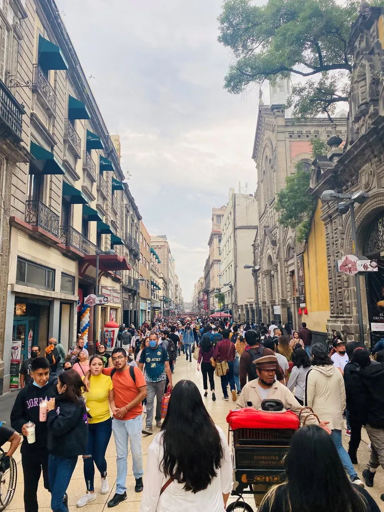

# Votre voyage au Mexique

---

Après avoir remis vos bagages au comptoir d’enregistrement, vous vous dirigez vers les contrôles de sécurité.

Vous gardez votre dictionnaire **espagnol** en main et étudiez la **langue officielle** du Mexique lors de votre attente.

___

Vous vérifiez vos articles personnels avant de vous installer. Heureusement, votre portefeuille est toujours dans votre poche!

Bien que le dollar américain est accepté dans les lieux touristiques, vous gardez quelques billets en **peso mexicain** (MXN) en réserve, car il s’agit de la **devise monétaire officielle**.

---

**Votre première destination, la ville de Mexico!**

Capitale du Mexique, cette ville compte plus de 9 millions d’habitants. Il s’agit de la plus grande centrale hispanophone du monde.

---

En effet, la population est composée:
- de **62%** Mestizo (Métis amérindien-Espagnol);
- de **21%** majoritairement améridiens;
- De **7%** amériediens;
- De **10%** autres (principalement européen).

---
<!-- _class: lead -->

### Seulement **0,02%** de la population sont des locuteurs **francophones.**
Peut-être que le cours d’espagnol était profitable après tout…

---

D’ailleurs, c’est grâce à la langue espagnole que les citoyens expriment leurs points de vue politique, car, en effet, le Mexique est une **démocratie**.

Le palais national est la résidence officielle du Président, **Andrés Manuel López Obrador**.

---

Chef du **Mouvement régénération nationale** (MORENA), López Obrador oppose le **Parti action nationale** (PAN).

Cela rend le Mexique une **république** théoriquement **socialiste.**

---

Avec une population de   **129 875 529 personnes** sous la responsabilité du gouvernement, il ne s’agit pas d’une tâche légère d’autant plus que les prochaines élections auront lieu en **2024**.

---

Les enjeux sociaux ne se réservent pas juste à un **indice de développement humain de 0,758**, au 86e rang à l’international, et à une espérance de vie de **73,46 ans**.

Le crime et l’immigration, entre autres, font partie des problèmes abordés jusqu’à aujourd’hui. 

---

<!-- _class: lead -->

### Assez de faits pour l’instant! Continuons notre **exploration...**

Comment pouvons-nous nous déplacer dans la ville   la plus densément peuplée en Amérique du Nord?

---

Le **2e plus grand système de métro** en Amérique du Nord, après New York, le métro de Mexico totalise 12 lignes différentes. 

Il relie notamment les deux plus grandes villes après Mexico, soit les régions d’**Iztapalapa** et d’**Ecatepec** en ordre.

---

**Iztapalapa** a connu un accroissement de population rapide, d'où viennent les maisons entassés causés par une **urbanisation excessivement rapide**. 

Associé à ce développement est un **taux de criminalité élevé**. Le trafic de drogues, la violence domestique et le viol sont des problèmes récurrents.

---

**Ecatepec** a un paysage similaire à celui de Iztapalapa. Il s’agit d’une ville construite sur les pentes des nombreuses **montagnes** avec des maisons qui remplissent les vallées.

Également hautement **peuplée**, beaucoup d'infrastructures de transport, notamment, y sont. 

--- 

<!-- _class: lead -->

### Maintenant que nous avons exploré les environs de Mexico, allons **plus loin!**

Au Nord se situe la métropole de Guadalajara,   à un peu plus de 400 km de la capitale.

---

La troisième plus grande ville autre que Mexico est **Guadalajara**. Il s’agit d’un centre économique grâce à **l'économie mixte** du pays, donc propice au **tourisme**.

Aussi, le **patrimoine** artistique et culturel présent qui relève de l’Histoire est unique. Voici l’église catholique du temple Expiatorio à gauche.

---

La cathédrale de Guadalajara témoigne également de la religion. Les principales religions sont composés:
- de **78%** Christianisme (Église Catholique);
- de **11,2%** Christianisme (Église Protestante);
- de **0,002%** autres religions;
- de **10,6%** non affilié (inclut l’Athéisme).

---

<!-- _class: lead -->

### Outre que la culture, la **nature** est aussi à explorer.

Construite sur des montagnes avec un relief accidenté,  le Mexique abrite de nombreux écosystèmes.

---

Le lac **Chapala** est le plus grand lac **d’eau douce** au Mexique, comparable au Grands Lacs.

---

Les **Barrancas del cobre** sont une chaîne de montagnes entrecoupés par un total de **six canyons**.

Les alpinistes sont les bienvenus!

---

<!-- _class: lead -->

### Dommage que notre **expédition aux montagnes** se termine…

Malgré les coups de soleil et l’application abusive de la crème solaire, le Mexique reste de même une évasion parfaite aux hivers québécois.

---

<!-- _class: lead -->

# Retournons au Canada!
