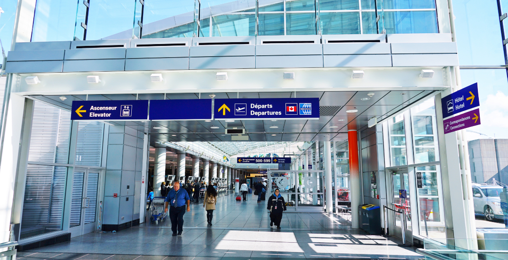

# Votre voyage au Mexique

---

Après avoir remis vos bagages au comptoir d’enregistrement, vous vous dirigez vers les contrôles de sécurité.

Vous gardez votre dictionnaire **espagnol** en main et étudiez la **langue officielle** du Mexique lors de votre attente.

___

Vous vérifiez vos articles personnels avant de vous installer. Heureusement, votre portefeuille est toujours dans votre poche!

Bien que le dollar américain est accepté dans les lieux touristiques, vous gardez quelques billets en **peso mexicain** (MXN) en réserve, car il s’agit de la **devise monétaire officielle**.
