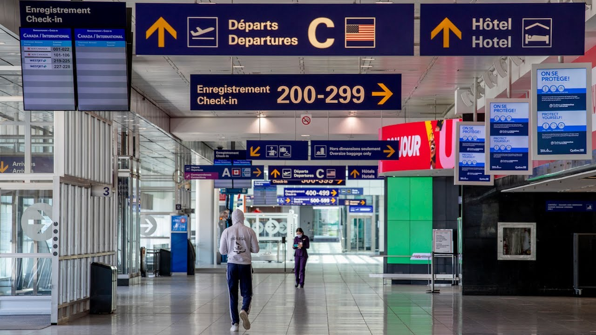

# ✈️ Votre voyage au Mexique ✈️

---

🧳 Après avoir remis vos bagages au comptoir d’enregistrement, vous vous dirigez vers les contrôles de sécurité. 

📚 Vous gardez votre dictionnaire **espagnol** en main et étudiez la **langue officielle** du Mexique lors de votre attente.

___

💳 Vous vérifiez vos articles personnels avant de vous installer. Heureusement, votre portefeuille est toujours dans votre poche!

💵 Bien que le dollar américain est accepté dans les lieux touristiques, vous gardez quelques billets en **peso mexicain** (MXN) en réserve, car il s’agit de la **devise monétaire officielle**.
