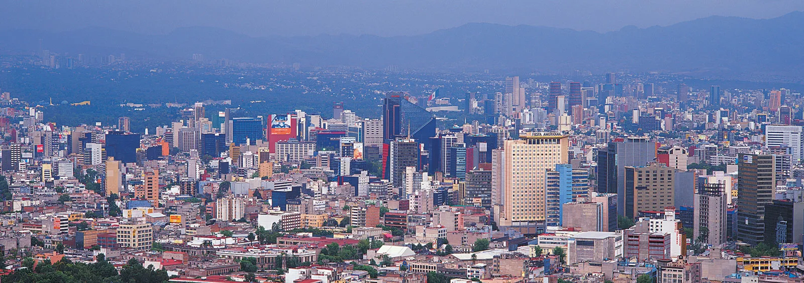

D’ailleurs, c’est grâce à la langue espagnole que les citoyens expriment leurs points de vue politique, car, en effet, le Mexique est une **démocratie**.

Le palais national est la résidence officielle du Président, **Andrés Manuel López Obrador**.

---

Chef du **Mouvement régénération nationale** (MORENA), López Obrador oppose le **Parti action nationale** (PAN).

Cela rend le Mexique une **république** théoriquement **socialiste.**

---

Avec une population de   **129 875 529 personnes** sous la responsabilité du gouvernement, il ne s’agit pas d’une tâche légère d’autant plus que les prochaines élections auront lieu en **2024**.

---

Les enjeux sociaux ne se réservent pas juste à un **indice de développement humain de 0,758**, au 86e rang à l’international, et à une espérance de vie de **73,46 ans**.

Le crime et l’immigration, entre autres, font partie des problèmes abordés jusqu’à aujourd’hui. 
