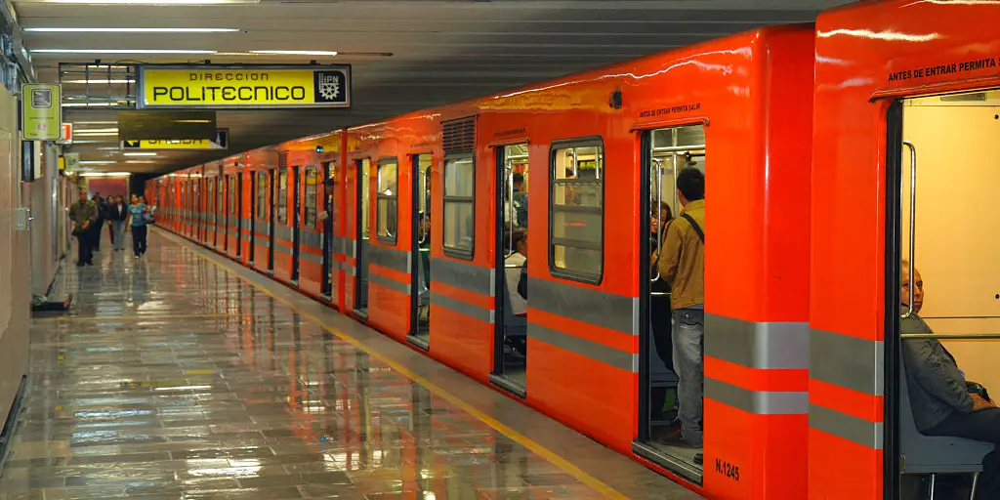
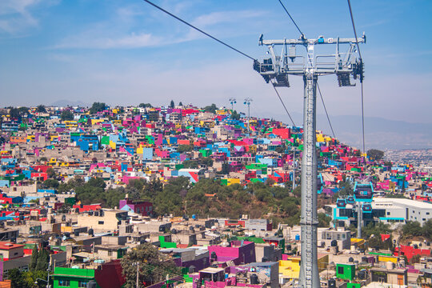

<!-- _class: lead -->

### Assez de faits pour l’instant! Continuons notre **exploration...**

Comment pouvons-nous nous déplacer dans une ville si densément peuplée?

---

🚇 Le **2e plus grand système de métro** en Amérique du Nord, après New York, le métro de Mexico totalise 12 lignes différentes. 

🚊 Il relie notamment les deux plus grandes villes après Mexico, soit les régions d’**Iztapalapa** et d’**Ecatepec** en ordre.

---

📈 **Iztapalapa** a connu un accroissement de population rapide, d'où viennent les maisons entassés causés par une **urbanisation excessivement rapide**. 

📊 Associé à ce développement est un **taux de criminalité élevé**. Le trafic de drogues, la violence domestique et le viol sont des problèmes récurrents.

---

⛰️ **Ecatepec** a un paysage similaire à celui de Iztapalapa. Il s’agit d’une ville construite sur les pentes des nombreuses **montagnes** avec des maisons qui remplissent les vallées.

🏚️ Également hautement **peuplée**, beaucoup d'infrastructures de transport, notamment, y sont. 
