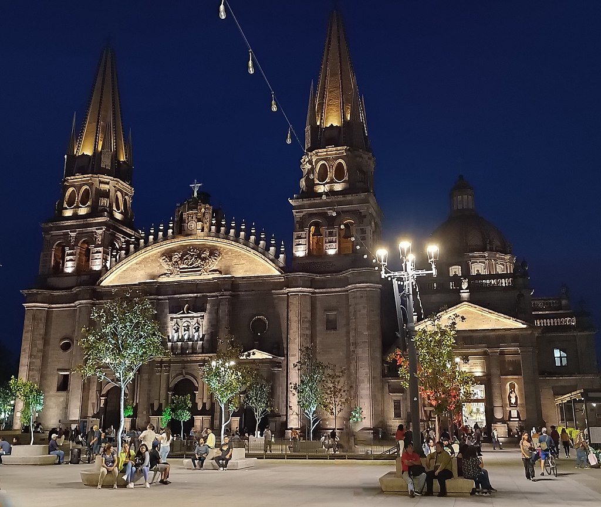

<!-- _class: lead -->

### Maintenant que nous avons exploré les environs de Mexico, allons **plus loin!**

Au Nord se situe la métropole de Guadalajara,   à un peu plus de 400 km de la capitale.

---

La troisième plus grande ville autre que Mexico est **Guadalajara**. Il s’agit d’un centre économique grâce à **l'économie mixte** du pays, donc propice au **tourisme**.

Aussi, le **patrimoine** artistique et culturel présent qui relève de l’Histoire est unique. Voici l’église catholique du temple Expiatorio à gauche.

---

La cathédrale de Guadalajara témoigne également de la religion. Les principales religions sont composés:
- de **78%** Christianisme (Église Catholique);
- de **11,2%** Christianisme (Église Protestante);
- de **0,002%** autres religions;
- de **10,6%** non affilié (inclut l’Athéisme).
