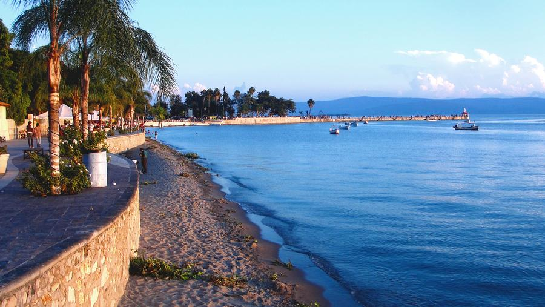

### Outre que la culture, la **nature** est aussi à explorer.

Un pays construit sur des montagnes avec un relief accidenté,  le Mexique abrite de nombreux écosystèmes.

---

🌊 Le lac **Chapala** est le plus grand lac **d’eau douce** au Mexique, comparable au Grands Lacs.

---

⛰️ Les **Barrancas del cobre** sont une chaîne de montagnes entrecoupés par un total de **six canyons**.

Les alpinistes sont les bienvenus!
